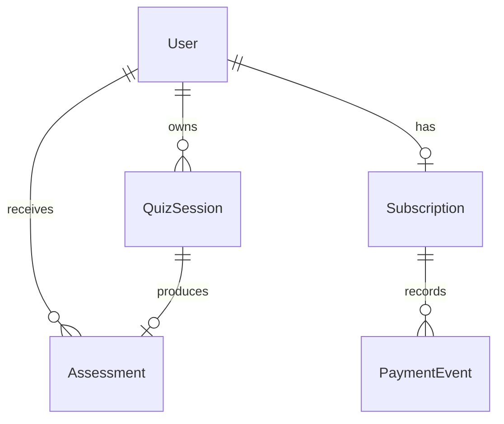

# FitPulse Health Quiz

一个面向健康测评 funnel 的全栈挑战项目：Next.js App Router + TypeScript + Prisma + PostgreSQL。核心覆盖分步保存、进度恢复、服务端健康评估、订阅鉴权、模拟支付回调和差异化结果返回。

## 在线演示

部署目标建议使用 Vercel + Supabase PostgreSQL。

- Demo URL: `https://<your-vercel-domain>`
- 付费测试 sessionId: `paid_demo_session_001`
- 付费测试 clientToken: `paid-demo-client`

> 当前仓库已准备好部署配置和 seed 数据；把 `DATABASE_URL` 配成 Supabase/Neon/PostgreSQL 后执行迁移与 seed 即可。

## 本地启动

```bash
npm install
cp .env.example .env
npm run prisma:migrate -- --name init
npm run seed
npm run dev
```

访问 `http://localhost:3000`。

如果本机暂时没有 PostgreSQL，也可以不创建 `.env` 直接运行 `npm run dev`。项目会启用仅供本地演示的内存仓库，并预置 `paid_demo_session_001`；线上部署和正式评审请务必配置 PostgreSQL `DATABASE_URL`。

## 核心 API

统一错误结构：

```json
{
  "error": {
    "code": "VALIDATION_ERROR",
    "message": "Request body failed validation.",
    "details": []
  }
}
```

### 创建或恢复测评

```bash
curl -X POST http://localhost:3000/api/sessions \
  -H "Content-Type: application/json" \
  -d '{"clientToken":"reviewer-device-001"}'
```

返回 `session.sessionId`。如果该 `clientToken` 已存在未完成测评，会返回最近的 draft session。

### 查询进度

```bash
curl "http://localhost:3000/api/sessions/SESSION_ID"
```

也可以按匿名设备恢复：

```bash
curl "http://localhost:3000/api/sessions?clientToken=reviewer-device-001"
```

### 分步保存

```bash
curl -X PATCH http://localhost:3000/api/sessions/SESSION_ID/answers \
  -H "Content-Type: application/json" \
  -d '{"step":"gender","data":{"gender":"FEMALE"}}'

curl -X PATCH http://localhost:3000/api/sessions/SESSION_ID/answers \
  -H "Content-Type: application/json" \
  -d '{"step":"goal","data":{"primaryGoal":"LOSE_WEIGHT"}}'

curl -X PATCH http://localhost:3000/api/sessions/SESSION_ID/answers \
  -H "Content-Type: application/json" \
  -d '{"step":"body","data":{"age":28,"heightCm":166,"weightKg":68,"targetWeightKg":61}}'

curl -X PATCH http://localhost:3000/api/sessions/SESSION_ID/answers \
  -H "Content-Type: application/json" \
  -d '{"step":"activity","data":{"activityFrequency":"MODERATE"}}'
```

### 提交并计算

```bash
curl -X POST http://localhost:3000/api/sessions/SESSION_ID/submit
```

服务端会计算 BMI、BMR、建议摄入、预计周数、目标日期和预测曲线，并写入 `Assessment` 表。

### 结果鉴权

未支付：

```bash
curl http://localhost:3000/api/sessions/SESSION_ID/results
```

返回 `access: "LOCKED"`，仅包含 BMI、BMI 分类和摄入范围，隐藏目标日期、预测曲线和完整建议。

已支付测试 session：

```bash
curl http://localhost:3000/api/sessions/paid_demo_session_001/results
```

返回 `access: "FULL"`，包含完整计划。

### 模拟支付回调

```bash
curl -X POST http://localhost:3000/api/pay \
  -H "Content-Type: application/json" \
  -d '{"sessionId":"SESSION_ID","idempotencyKey":"reviewer-pay-001","amountCents":1900,"currency":"CNY"}'
```

线上替换域名：

```bash
curl -X POST https://<your-vercel-domain>/api/pay \
  -H "Content-Type: application/json" \
  -d '{"sessionId":"SESSION_ID","idempotencyKey":"reviewer-pay-001"}'
```

支付接口会把该用户的 `Subscription.status` 改为 `ACTIVE`，并写入 `PaymentEvent`。同一个 `idempotencyKey` 可安全重放。

## 数据库 Schema

Mermaid 图见 [docs/schema.mmd](docs/schema.mmd)。



## 设计取舍

- `clientToken` 用于匿名设备识别，满足随机 UserID / 简易 Session 的恢复要求。
- 分步数据直接落到 `QuizSession` 的结构化字段，避免纯 JSON 难以校验和查询；`healthContext` 保留扩展空间。
- `Assessment` 与 `QuizSession` 一对一，提交后通过事务更新 session 状态并 upsert 结果，保证结果可重算、可覆盖。
- `Subscription` 与用户一对一，`PaymentEvent` 记录幂等支付事件，方便后续替换 Stripe、Paddle 或微信支付回调。
- 结果接口只有一个，内部按订阅状态做字段分层，避免前端绕过 paywall 读取完整数据。

## 部署步骤

1. 创建 Supabase 或 Neon PostgreSQL 数据库。
2. 在 Vercel 导入仓库，配置 `DATABASE_URL` 和 `NEXT_PUBLIC_APP_URL`。
3. 在部署前或首次部署后执行：

```bash
npm run prisma:migrate -- --name init
npm run seed
```

4. 将 Vercel URL、GitHub URL、`paid_demo_session_001` 和 `/api/pay` cURL 放入交付邮件。

## AI 使用复盘

详见 [docs/AI_REVIEW.md](docs/AI_REVIEW.md)。
